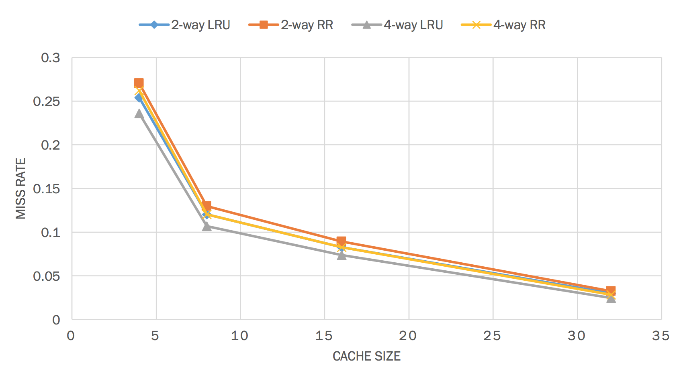
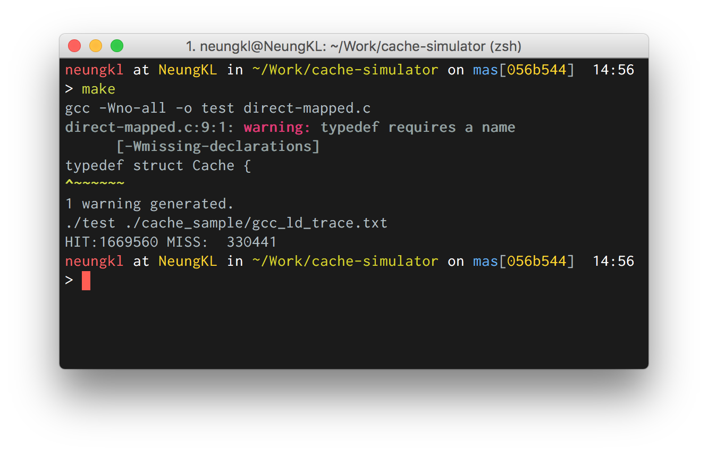
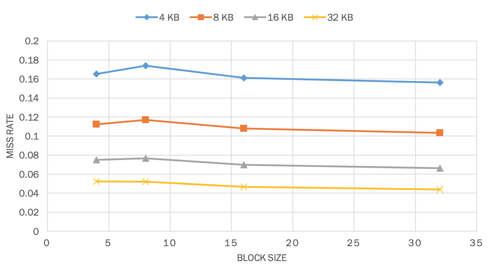

Cache Simulator
===

This is a homework for 2110352 Computer System Architecture class.



## Assignment

The summarize of the task is try simulate cache with direct mapped method
and N-way associative cache with two replacement algorithm, round robin and least
recently used.

The original task in [assignment.pdf](assignment.pdf) file.<br>
And original code provide in [Simulator.c](Simulator.c)

## Source Code

Here are a list of my code customize from `Sumulator.c`

- `direct-mapped.c` Direct mapped cache simulation
- `least-recently-use.c` N-way associative with least recently used replacement.
- `round-robin.c` N-way associative with round robin.

The code will read the access address from file in `cache_sample` directory and parsing into binary address.

Then, program will run through the input and calculate the `HIT` times and `MISS` times of memory and show result to terminal.

## How to Run

#### Prerequisites
- gcc compiler
- make

#### Configuration

1. Select the file you would like to run by customize the `SOURCE_CODE` variable in `Makefile`
2. Customize the define variable in each `*.c` file
````c
#define INDEXLEN <NUM>    // Bit Length of Index
#define WAYLEN <NUM>      // Bit Length of Way Size
#define BLOCKLEN <NUM>    // Bit Length of Block Size
```
3. run `make`

`INDEXLEN` define how many bits used for index.<br>
`BLOCKLEN` define how many blocks in the cache.<br>
`WAYLEN` how many N-way cache blocks in associative method.

*Note : `WAYLEN` not available in `direct-mapped.c` file*

#### Example Result



## Report

Here are a some summarize graph of testing data on simulation.<br>
See more description and the full report in [report.pdf](report.pdf)

**Direct Mapped**



**N-Way Associative with replacement method**


## Author

- Kosate Limpongsa (Me)
- Kasidit Iamthong ([@futurizing](https://github.com/futurizing/))

## License
The MIT License (MIT)
Copyright (c) 2016 Kosate Limpongsa

Permission is hereby granted, free of charge, to any person obtaining a copy of this software and associated documentation files (the "Software"), to deal in the Software without restriction, including without limitation the rights to use, copy, modify, merge, publish, distribute, sublicense, and/or sell copies of the Software, and to permit persons to whom the Software is furnished to do so, subject to the following conditions:

The above copyright notice and this permission notice shall be included in all copies or substantial portions of the Software.

THE SOFTWARE IS PROVIDED "AS IS", WITHOUT WARRANTY OF ANY KIND, EXPRESS OR IMPLIED, INCLUDING BUT NOT LIMITED TO THE WARRANTIES OF MERCHANTABILITY, FITNESS FOR A PARTICULAR PURPOSE AND NONINFRINGEMENT. IN NO EVENT SHALL THE AUTHORS OR COPYRIGHT HOLDERS BE LIABLE FOR ANY CLAIM, DAMAGES OR OTHER LIABILITY, WHETHER IN AN ACTION OF CONTRACT, TORT OR OTHERWISE, ARISING FROM, OUT OF OR IN CONNECTION WITH THE SOFTWARE OR THE USE OR OTHER DEALINGS IN THE SOFTWARE.
